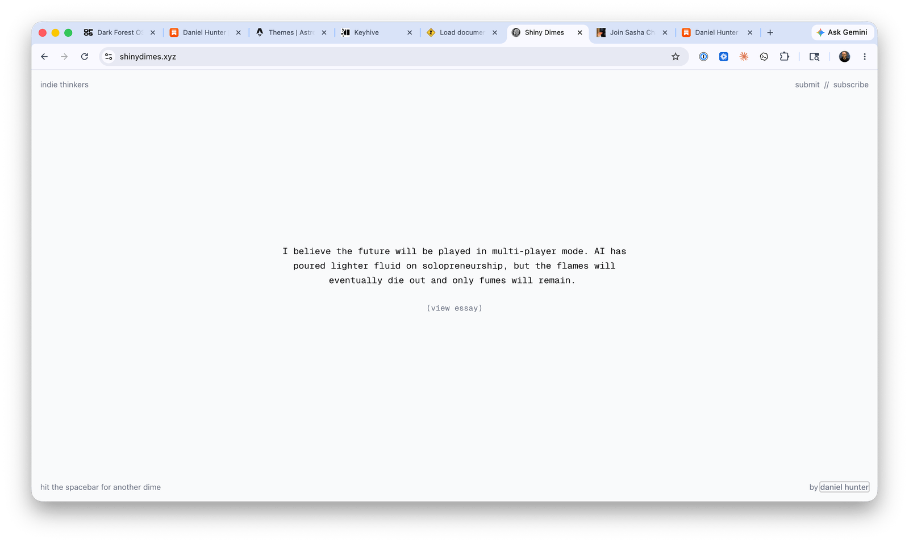

## Joysticks

Here's my [spiky point of view](https://www.weskao.com/blog/spiky-point-of-view-lets-get-a-little-controversial): I believe **the future will be played in multi-player mode**. AI has poured lighter fluid on solopreneurship, but the flames will eventually die out and only fumes will remain. 

Okay, well, how and where should people collaborate?

Plant a tree in the dark forest.

At first glance, the [Dark Forest Operating System](https://dfos.com/) might appear to be simply a lightweight version of Discord with a blog baked in, but there are unique primitives that stand out, like community treasuries.

When you launch a space, you can install the following native apps:

- Chat
- Blog
- Newsletter
- Groups
- Treasury

DFOS is a nascent platform and that comes with inherent risk for community builders, but I'm making a concious decision to support it nonetheless. I see the vision and want everyone involved to succeed. 

After a bit of a rocky start, they're hitting their stride. I find some solace in the fact that DFOS is the brainchild of [Yancey Strickler](https://www.metalabel.com/ystrickler), [Metalabel](https://www.metalabel.com/about) founder. It won't just dissapear overnight like a vibe coded micro-saas app. Yancey's flagship DFOS space, [New Creative Era](https://nce.dfos.com/), gives me all the warm Arcade Game era energy I didn't realize I was missing.

Eventually, Indie Thinkers will open a community treasury on DFOS that will be used to fund and launch essays. I use the word launch intentionally here. Prose, done well, is a legit product, and deserves the same packaging given to a feature release at a venture-backed startup.

The treasury won't be a vague community wallet or crypto gimmick. It'll be a real pool of money used to pay writers and artists. If someone has a dope idea but not the time, resources, marketing, or design sense to turn it into something bigger, Indie Thinkers will be able to support them.

## Code & Prose

We've moved Indie Thinkers dot com to a new home.

I'm not here to dunk on Substack. They gave writers a place to live and they made publishing more approachable for thousands of writers. It's still home to some of the best writing on the internet, full stop. But platforms like Substack and Medium flattened the presentation layer. 

Everything kind of looks the same now.

- 
- 
- 
- 

When George Mack dropped his [High Agency](https://www.highagency.com/) essay as a dedicated micro-site, I saw a glimpse of what I wanted to create for myself, and eventually for other writers. I hadn't seen a web domain dedicated to one essay like this before and was inspired to elevate the written word to a level that demanded its own space to breathe in.

Timing is everything so why move now? [HTML](https://developer.mozilla.org/en-US/docs/Web/HTML) is having a renaissance moment.

Tariq reminded everyone that Hypertext Markup Language is pretty dope. He also rocked the internet when he made the assertion:

> **HTML** is the new markdown.

<blockquote class="twitter-tweet" data-dnt="true">
	<a href="https://x.com/trq212/status/2052811606032269638?s=20">View this post on X</a>
</blockquote>

The beauty, and opportunity, of having full control over a HTML document is that it allows writers to be far more expressive than they could be in a [Markdown](https://daringfireball.net/projects/markdown/) file or a traditional blogging and newsletter platform like Substack. Some ideas need to stretch well into the margins.

**Every.**

**Cleartext.**

**Lit in Colour.**

**Indie Thinkers.**

Writers need more platforms that allow them to publish writing on the internet that pushes the boundaries of what we're accustomed to seeing. This is the type of experience that is just not possible to create on Substack. 

We're not leaving the platform completely. We'll still leverage it for newsletter delivery, podcast episodes, and Notes.

## A Human Language Model

What is Indie Thinkers?

I spent a lot of time this past week considering the future. I kept circling around this concept: Human Language Model.

Before LLMs we had HLMs. Libraries, magazines, newspapers, etc.

To be clear, I'm not anti-AI. I'm just pro human-in-the-loop. AI makes language more powerful. Indie Thinkers exists to explore the human side of that power. Things like decision-making, lived experiences, conviction, risk, and spiky points of view. A willingness to say, "This is what I think, and I am willing to be seen thinking it."

The more I thought about this, the more I realized that building a human language model is actually one of the more pro-AI things you could do. LLMs will need new HLMs to train on. All of our writing will be open source and none of it will live behind a paywall.

Indie Thinkers can be a modern-day human language model. A community building a body of work that helps chronicle the human condition and leaves behind evidence of life long after robots roam the earth.

A digital lab for writers to explore ideas and present them in unique ways. In the most simple terms, Indie Thinkers is both community and publisher. We'll elevate the work of others and support independent writers directly. We're not trying to hire staff writers, but we want to pay contributors.

This type of project is well suited to be run like an open source project. Each author is a contributor. Every essay is simply a pull request on Github. One beautiful thing about AI is everyone is far more technical than they once were and having a writer submit a PR no longer sounds crazy. This unlocks new opportunities for human coordination and collaboration.

## What We're Not Doing

We are not trying to become [The Atlantic](https://www.theatlantic.com/).

Like I said earlier, we're not hiring staff writers, building a giant editorial machine, or pretending that getting 10,000 subscribers is a meaningful milestone. We'd much rather have 1,000 that are engaged. We're not trying to become another content treadmill.

The internet already has enough feeds. Enough takes. Enough growth hacks. Enough writing optimized to be glanced at between notifications.

The goal is not to publish more.

The goal is to publish work that feels worth returning to.

In my own freewriting sessions, I kept comparing the shape of Indie Thinkers to a mix of [Farnam Street](https://fs.blog/), [Indie Hackers](https://www.indiehackers.com/), [Every](https://every.to/), and [Stripe Press](https://press.stripe.com/). That still feels directionally right.

Every has a sense of timeliness and intellectual range. Farnam Street almost feels like a library. You read each newsletters and know what your reading will be useful years from now. Stripe Press treats ideas like works of art. The packaging for their books arrive at your doorstep with great care. The podcast interviews on Indie Hackers were honest and the name itself became an identifier for thousands of builders.

Indie Thinkers weill ship essays that sit somewhere in the middle. Timely enough to matter now. Timeless enough to matter later. Designed well enough to feel like the medium respects the idea, and open enough to be trusted.

## Fin

I want my life's work to be centered around elevating the work of others. Sounds lofty, but it's real. I get the most joy from helping someone clarify an idea and get it into the world.

We do not know the hour, nor the day, when the clock will stop. It's a bit morbid, but one of the best things you can do to get out of a rut is to read someone's obituary or [eulogy](https://archive.nytimes.com/www.nytimes.com/books/98/03/29/specials/baldwin-morrison.html). Life is precious. It is both long and painfully. I have conviction that my role in this world is centered around servant leadership.

I like the feeling of building a container that makes other people's work more likely to travel. If you'd like to write for Indie Thinkers at some point, even if you don't have an idea and don't know where to start, I encourage you to reach out to me directly at [daniel@indiethinkers.com](mailto:daniel@indiethinkers.com) or join the community.

-- Daniel
