## Joysticks

Here's my [spiky point of view](https://www.weskao.com/blog/spiky-point-of-view-lets-get-a-little-controversial): I believe **the future will be played in multi-player mode**. AI has poured lighter fluid on solopreneurship, but the flames will eventually die out and only fumes will remain. 

Everyone [keeps yelling](https://x.com/gregisenberg/status/2038706332119797894?s=20) about how important distribution is. We get it. We know that slop is a plague covering the earth with no Moses to save us and trying to out-post everyone is a fool’s errand. 
You can try and brute-force attention capture but the cost of human eyeballs has gone up and you'll ultimately look like a clown. Yesterday's price is not today's price. 

Please listen to [George Mack](https://x.com/george__mack/status/2060154109974679825) here:

<figure class="george-mack-quote" aria-label="George Mack quote about two ways to create content">
  <blockquote>
    
Two ways to create content right now

    

      1
      

        
The slop zone

        
Increase quantity of posts. Post 10-20x per day. Churn out clip farms. Win the war of throwing as much shit at the algorithm. People don't remember what you post, but they remember that you post.

      

    

    

      2
      

        
The golden hippos on unicycles zone

        
Increase quality of posts. Post something awesome 1-4x per year. Whilst everyone is speeding up, slow down, and spend 100x more time on the quality. Focus on making something people remember and share one year later.

      

    

  </blockquote>
</figure>

It's kind of wild to think about only posting 4 times a year, but if you were a part of something bigger than yourself and you helped ship 24 essays in a year, that would still be gratifying and more impactful.

Okay, well, how and where should people collaborate?

Plant a tree in the dark forest.

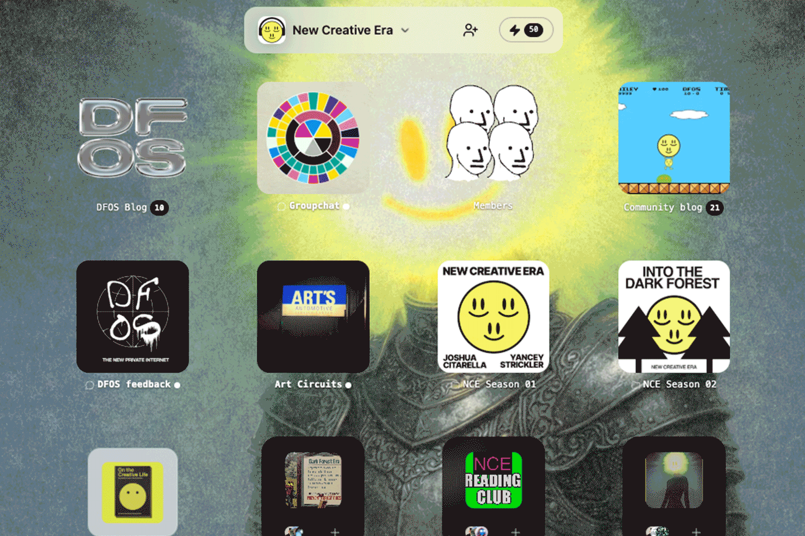

<em>A collection of DFOS spaces, courtesy of Yancey Strickler</em>

At first glance, the [Dark Forest Operating System](https://dfos.com/) might appear to be just a lightweight version of Discord with a tiny blog baked in, but there are unique primitives that stand out here, like community treasuries.

When you launch a space, you can install the following native apps:

- Chat
- Blog
- Newsletter
- Groups
- Treasury
- Custom Apps (soon)

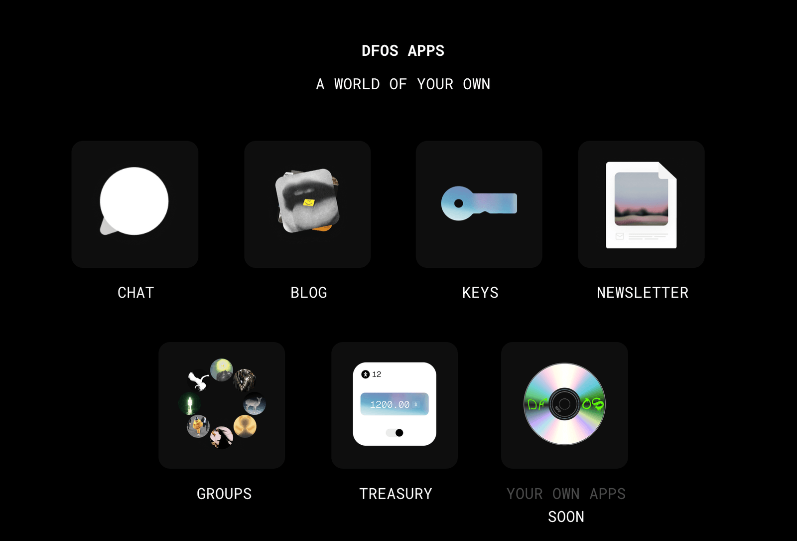

DFOS is a nascent platform and that comes with inherent risk for community builders, but I'm making a conscious decision to support it. I see the vision and want everyone involved to succeed. 

I find solace in the fact that DFOS is the brainchild of [Yancey Strickler](https://www.metalabel.com/ystrickler), the founder of [Metalabel](https://www.metalabel.com/about) and a co-founder of the crowdfunding giant Kickstarter. The Dark Forest won't just disappear overnight like a vibe coded micro-saas app. Yancey's flagship DFOS space, [New Creative Era](https://nce.dfos.com/), gives me all the warm arcade game era energy I didn't realize I was missing.

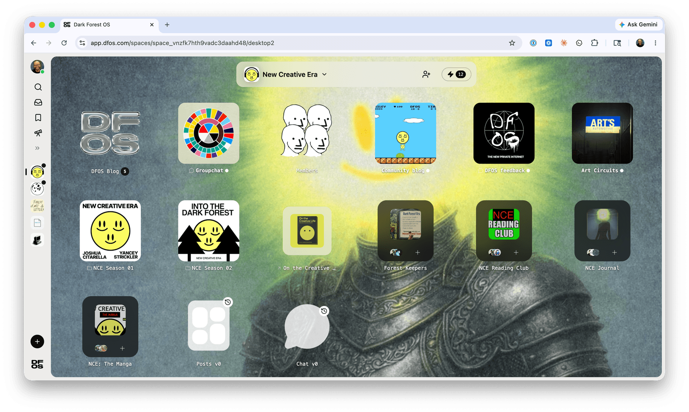

Eventually, Indie Thinkers will open a community treasury on DFOS that will be used to fund and launch essays. I use the word launch intentionally here. Prose, done well, is a legit product, and deserves the same packaging given to a feature release at a venture-backed startup.

The treasury won't be a vague community wallet or crypto gimmick. It'll be a real pool of money used to pay writers and artists. If someone has a dope idea but not the time, marketing resources, or design sense to turn it into something bigger, Indie Thinkers will be able to support them.

## Code & Prose

You may have noticed, we moved Indie Thinkers dot com to a new home.

I'm not here to dunk on Substack. They gave writers a beautiful place to live and collaborate. Features like recommendations and guest posts were a big deal when they first launched. Substack made publishing more approachable and it's still home to some of the best writing on the internet, full stop. But platforms like Substack and Medium flattened the presentation layer. Everything kind of looks the same now.

- 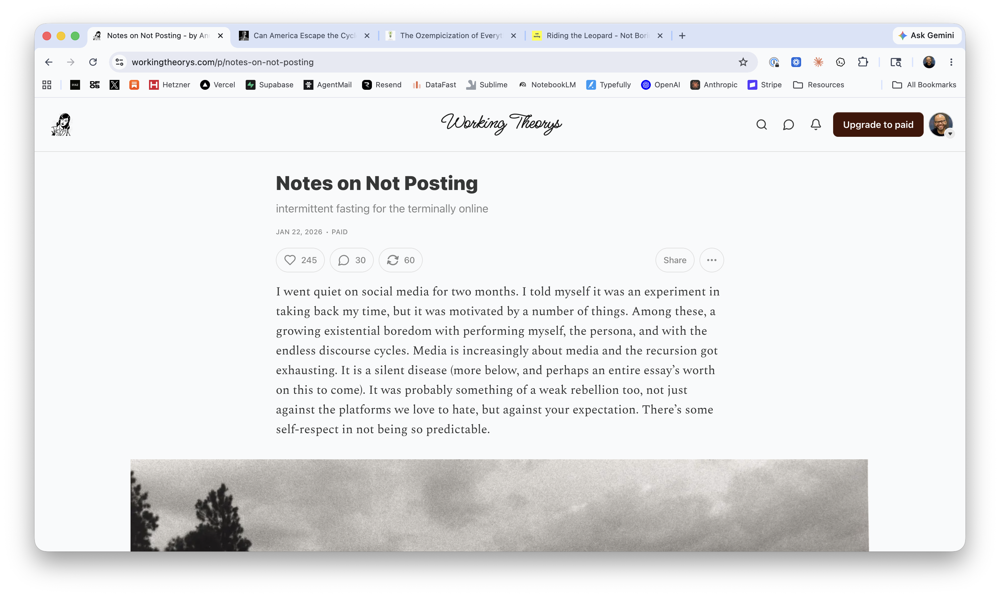
- 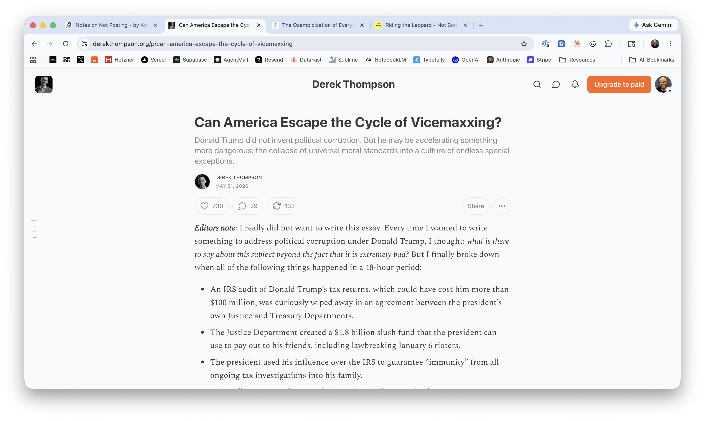
- 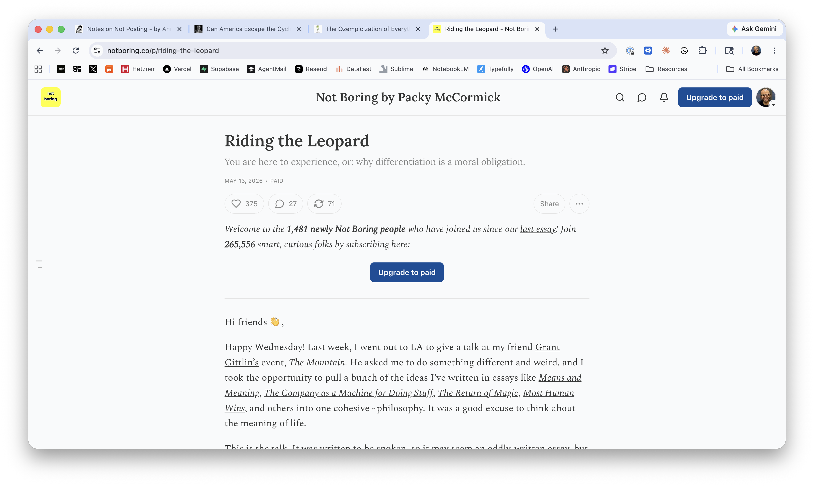
- 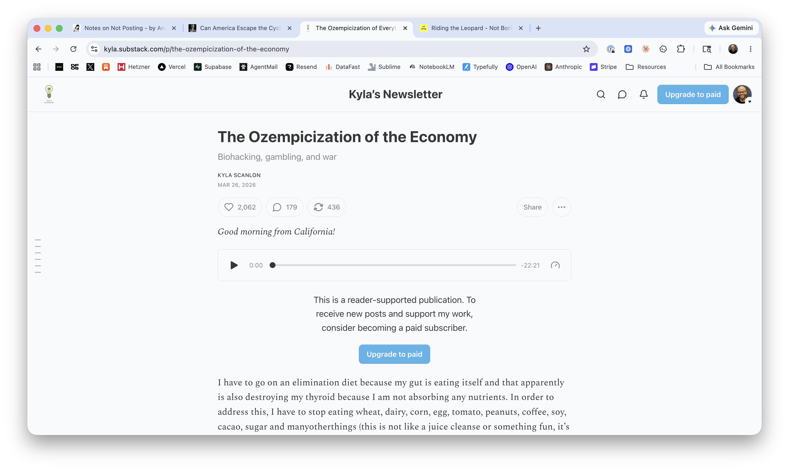

When George Mack dropped his [High Agency](https://www.highagency.com/) essay as a dedicated micro-site, I saw a glimpse of what I wanted to create for myself, and eventually for other writers. I hadn’t seen someone give a single essay its own domain before. At the time I didn't quite know what do with the idea though, so I bookmarked it in my brain and moved on.

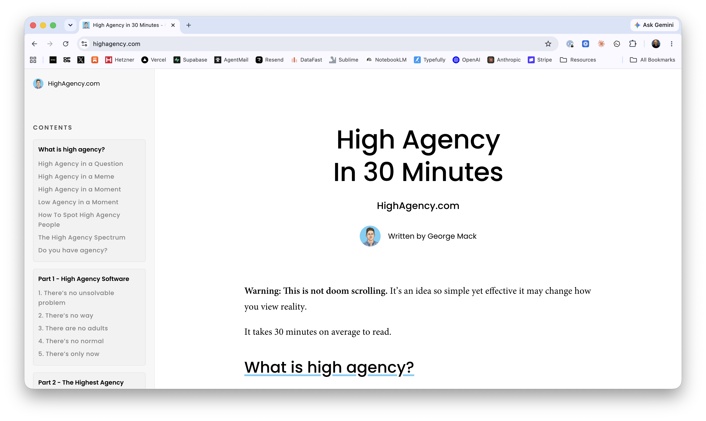

Then Tariq reminded me and everyone else that HTML is incredible. 

He rocked the internet with the following assertion:

> **HTML** is the new markdown.

<blockquote class="twitter-tweet" data-dnt="true">
	<a href="https://x.com/trq212/status/2052811606032269638?s=20">View this post on X</a>
</blockquote>

The beauty, and opportunity, of having full control over an HTML document is that it allows writers to be far more expressive than they could be in a [Markdown](https://daringfireball.net/projects/markdown/) file or a traditional blogging / newsletter platform like Substack. Some ideas need to stretch well into the margins.

**Every.**

[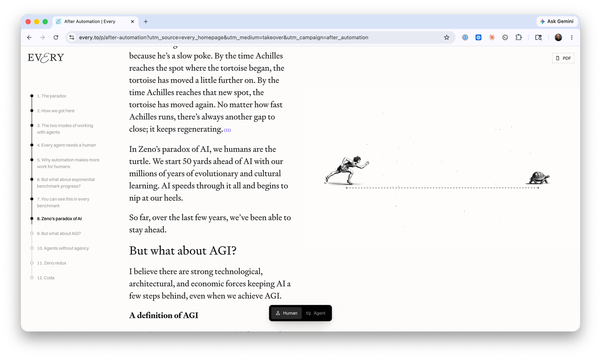](https://every.to/p/after-automation)

<em><a href="https://every.to/p/after-automation">https://every.to/p/after-automation</a></em>

**Cleartext.**

[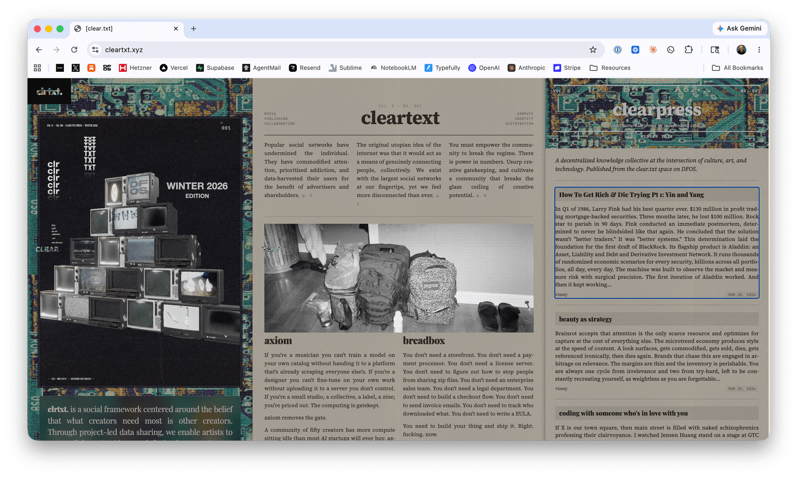](https://cleartxt.xyz/)

<em><a href="https://cleartxt.xyz">https://cleartxt.xyz</a></em>

**Lit in Colour.**

[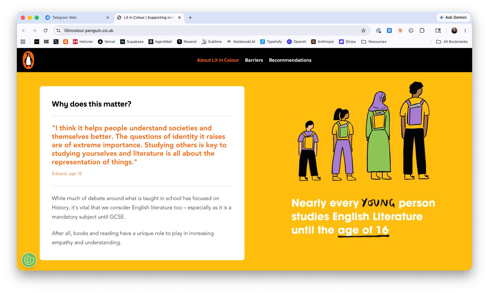](https://litincolour.penguin.co.uk/)

<em><a href="https://litincolour.penguin.co.uk">https://litincolour.penguin.co.uk</a></em>

**Indie Thinkers.**

<video class="scroll-play-video" muted loop playsinline preload="metadata" aria-label="Indie Thinkers demo video">
	<source src="/media/the-internet-in-multi-player-mode/indie-thinkers-demo-v4.mp4" type="video/mp4" />
</video>

<em><a href="https://www.indiethinkers.com">https://www.indiethinkers.com</a></em>

We need more platforms that allow writers to publish prose on the internet that pushes the boundaries of what we're accustomed to seeing. This type of experience is just not possible on Substack. 

We're not leaving the platform completely. We'll still leverage it for newsletter delivery, podcast episodes, and notes.

## A Human Language Model

What is Indie Thinkers?

I spent a lot of time the past few weeks mulling over the future. I kept circling around this concept: **Human Language Model**.

Before LLMs we had HLMs. Libraries, literary magazines, and newspapers.

To be clear, I'm not anti-AI. I'm just pro human-in-the-loop. AI makes language more powerful. Indie Thinkers exists to explore the human side of that power. Things like decision-making, lived experiences, conviction, risk, and spiky points of view. A willingness to say, "This is what I think, and I am willing to be seen thinking it."

The more I thought about this, the more I realized that building a human language model is actually one of the more pro-AI things you could do. LLMs will need new HLMs to train on. This isn't the purpose of Indie Thinkers but we won't prevent labs from using our work. All of our writing will be open source and none of it will live behind a paywall.

This type of project is well suited to be run like an open source project. Each author is a contributor. Every essay is simply a pull request on GitHub. One beautiful thing about AI is everyone is far more technical than they once were and having a writer submit a PR no longer sounds crazy. This unlocks new opportunities for human coordination and collaboration.

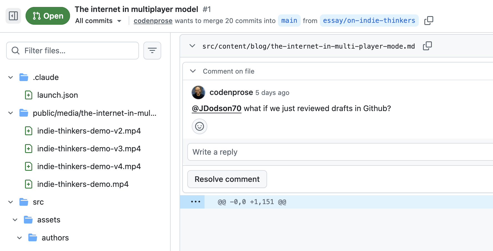

Indie Thinkers can be a modern-day human language model. We'll build a body of work that helps chronicle the human condition and leaves behind evidence of life long after our robot friends roam the earth.

A digital lab for writers to explore ideas and present them in unique ways. In the most simple terms, Indie Thinkers is both community and publisher. We'll elevate the work of others and support independent writers directly. We're not trying to hire staff writers, but we want to pay contributors.

## What We're Not Doing

We are not trying to become [The Atlantic](https://www.theatlantic.com/).

Like I said, we're not hiring staff writers, building a giant editorial machine, or pretending that getting a specific number of subscribers will grant us a wish. We'd much rather have a smaller group of readers who are actually engaged. We're not trying to become another content treadmill. The internet already has enough feeds. Enough takes. Enough growth hacks. Enough writing optimized to be glanced at between notifications.

The goal is not to publish more.

The goal is to publish work that feels worth returning to.

We're opting out of the slop zone.

In my own freewriting sessions, I kept comparing the shape of Indie Thinkers to a mix of [Farnam Street](https://fs.blog/), [Indie Hackers](https://www.indiehackers.com/), and [Stripe Press](https://press.stripe.com/) for essays. That still feels directionally right.

Farnam Street is a timeless digital library. After you read Brain Food, what your mind consumed will be useful years from now. The interviews on Indie Hackers were honest and the name itself became an identifier for thousands of builders. Stripe Press treats ideas like works of art. The packaging for their books arrive at your doorstep with great care. 

## Fin

I want my life's work to be centered around elevating others. Sounds lofty, but it's real. I get the most joy from helping someone clarify an idea and get it out into the world. I want to build a vehicle that makes other people's work more likely to travel.

We do not know the hour, nor the day, when the clock will stop. It's a bit morbid, but one of the best things you can do to get out of a rut is to read someone's obituary or [eulogy](https://archive.nytimes.com/www.nytimes.com/books/98/03/29/specials/baldwin-morrison.html). Life is precious. It is both long and painfully short. I have conviction that my role in this world is centered around servant leadership.

There's still so much to figure out, but I'd love to have you be a part of this journey and contribute. If you'd like to write for Indie Thinkers at some point, even if you don't have an idea and don't know where to start, I encourage you to reach out to me directly at [daniel@indiethinkers.com](mailto:daniel@indiethinkers.com).

-- Daniel

	<a href="https://x.com/danielkhunter">x.com/danielkhunter</a>
	<a href="https://github.com/danielkhunter">github.com/danielkhunter</a>
	<a href="https://substack.com/@danielkhunter">substack.com/@danielkhunter</a>

