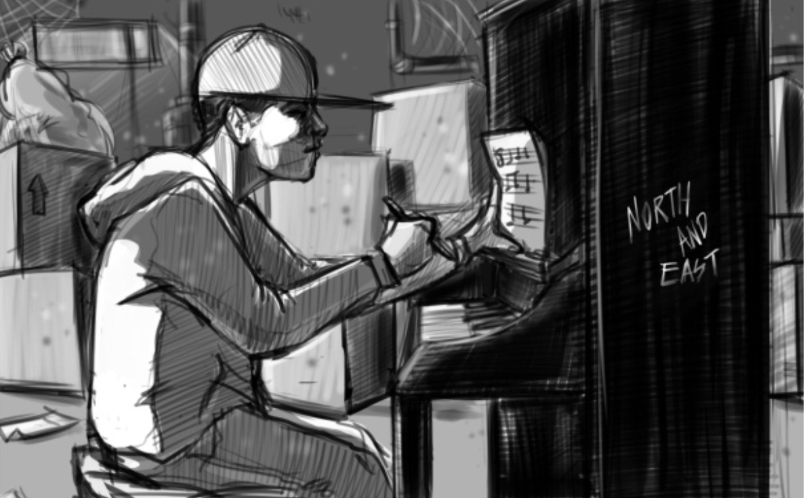

In 2010, I was a sound editor at a small post-production facility in Santa Monica, working on everything from MTV’s *The Hills* to HBO’s *Curb Your Enthusiasm*. When I started, I rarely saw people who looked like me in those rooms. That absence became [Post in Black](https://postinblack.com/), a blog that has grown into a podcast entering its seventh season with industry heavyweights like Dolby sponsoring.

For the past seven years, my brother David and me have spent hundreds of hours interviewing composers, editors, visual effects artists, colorists, sound editors, music supervisors, and mixers. It’s a celebration of Black excellence behind the lens. Each podcast episode gives guests room to tell their story.

These are the stories mainstream outlets often miss.

	<iframe
		src="https://www.youtube-nocookie.com/embed/BRhS6rTkEO4?rel=0"
		title="How This Composer Stopped Saying “No” to Herself & Landed Universal Music | Ft. Shameka Dwight | Post in Black"
		loading="lazy"
		allow="fullscreen; picture-in-picture"
		allowfullscreen
	></iframe>

<em>My brother David Hunter, Jr. with composer Shameka Dwight.</em>

I didn’t realize I was doing anything remotely close to journalism until we started attending industry events and people would thank us for sharing original stories they had never heard before.

Then recent college grads would DM us on IG saying they didn’t know people who looked like them were working on big-budget projects. We were doing far more than just recording interviews. Editor [Terilyn Shropshire](https://www.youtube.com/watch?v=T1xX_PE9ero&t=1s) said that we were “chronicling the lives of everyone behind the scenes for future generations.”

I didn’t quite know how to describe the type of writer I wanted to be until I heard [Jasmine Sun](https://jasmi.news/) use the phrase “capital J journalism” in her interview with [Jackson Dahl](https://jdahl.substack.com/p/jasmine-sun).

> When I’m doing capital “J” journalism and I’m actually reporting out a piece... it’s almost always a research question that I do not know the answer to.
>
> — Jasmine Sun

If I were to define little “j” journalism, I’d say it means doing journalistic work without claiming the full professional label. It means asking real questions, checking the record, giving people context, representing them fairly, linking to sources when I can, and correcting what I get wrong. The lowercase matters because it keeps my ambition honest. I’m not pretending to be a beat reporter. I’m trying to practice the parts of journalism that help people see more clearly.

I still hesitate to fully claim ‘journalist’ as a label, mostly because I respect the profession too much to treat it like a costume. Just because AI allows anyone to build software, that doesn’t make everyone a software engineer. I feel the same way about journalism. *Writer* still feels more accurate because it leaves room for essays, interviews, screenwriting, short stories, and software. But the work I keep returning to has a journalistic impulse: find the story, ask better questions, and make the record stronger than it was before.

> I like the word writer because I like how **expansive and big tent** it is... **journalist, comes with baggage**.
>
> — Jasmine Sun

If you know folks who work in post-production, many of them will note the challenge of spending hours on end in dark, windowless rooms. Somehow, those rooms became a creative space for me. Whenever I had a spare moment, I wrote. This is when I fell in love with storytelling. Over the course of a year, I ended up writing my first feature-length screenplay *North and East*, a coming-of-age story about a composer studying at [Berklee College of Music](https://college.berklee.edu/), loosely based on my experience as a student there.

<em>Storyboard for North and East circa 2011</em>

If I were forced to label myself, I’d be considered a [writer-builder](https://www.workingtheorys.com/p/writer-builder).

This line attributed to C.S. Lewis defined vibe coding well before Karpathy coined it:

> You can make anything by writing.

Writing isn’t just thinking or self-expression. A screenplay becomes a film. A cold email becomes a career. A collection of questions becomes a treasured archive of interviews. Structured natural language can become [malleable software](https://www.inkandswitch.com/essay/malleable-software/).

<blockquote class="twitter-tweet" data-dnt="true">
	
The hottest new programming language is English

	&mdash; Andrej Karpathy (@karpathy) <a href="https://x.com/karpathy/status/1617979122625712128">January 24, 2023</a>
</blockquote>

The intersection of code and prose is where [indiethinkers.com](https://indiethinkers.com/) was born and the larger experiment behind the [human language model](https://github.com/indiethinkers/human-language-model) project: a literary publication built in public, with the same care people bring to open-source software. While the writer-builder label does fit me well, there’s something deeper about journalism.

I love:

- Creating profiles of people I admire.
- Giving the underrepresented a platform to tell their stories.
- Helping the general public understand something more clearly.
- Giving people access and insight into spaces they were not invited into.

Terilyn’s words stuck with me. There are scenes throughout the world that most media outlets will never have the time, access, or incentive to capture. The writer editing timeless essays without compensation or recognition. The colorist who shaped a film’s entire mood but gets buried in the credits. The software engineer who just got laid off from a remote gig and is struggling in a small town.

Journalism, at its best, keeps a record for future generations.

That is the work I want to do here. My focus will be on code, prose, and the future of work. I’m still figuring out what kind of writer I am. But I know the work that motivates me every day. I want to find people worth paying attention to, ask insightful questions, and make their stories harder to miss. Maybe that’s little “j” journalism: research and writing with a responsibility to look closely at the underdogs of the internet. For now, that’s enough to work with.

-- Daniel

	<a href="https://x.com/danielkhunter">x.com/danielkhunter</a>
	<a href="https://github.com/danielkhunter">github.com/danielkhunter</a>
	<a href="https://substack.com/@danielkhunter">substack.com/@danielkhunter</a>

